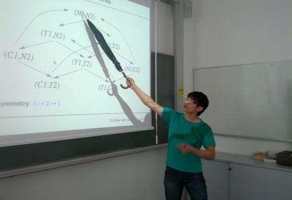

# Homepage of Anthony Widjaja Lin [previously Anthony W. To]

## NEWS
- I am delighted to have received an [ERC Consolidator Grant](https://erc.europa.eu/news-events/news/erc-2022-consolidator-grants-results) on Logic and
  Automata over Sequences with Data. I will be looking for PhD Students and
  Postdoc Researchers soon. Please let me know if you are interested.
- Two papers appearing in LICS'22.
- A [new graph database paper](papers/pods22.pdf) appearing in PODS'22.
- I am delighted to be invited to present at [SynCoP'22](https://project.inria.fr/syncop22/). The slides can be found [here](slides/syncop22.pdf).
- [Two new papers](publications.html) on string solving appearing in CPP'22 
(Distinguished Paper Award) and POPL'22.
- Aug'21: Amazon Research Award - thank you for the generous support
- I am delighted to be invited to present at [TPSS'21](https://tpss-workshop.github.io/). Here are my [slides](slides/TPSS21.pdf).

## Background
- Professor in Theoretical Computer Science (Automated Reasoning), ERC 
Starting Grant Fellow, and Max-Planck Fellow at [Technical University of 
Kaiserslautern, Germany](https://www.informatik.uni-kl.de/)
- Previously:
  - (2016 - 2019) Associate Professor in Programming Languages at [Oxford University Department of Computer Science](https://www.cs.ox.ac.uk/) and Governing Body Fellow at [Kellogg College](https://www.kellogg.ox.ac.uk/). I taught at the
[MSc Software Engineering Programme](https://www.cs.ox.ac.uk/softeng/).
  - (2014 - 2016) assistant professor at [Yale-NUS, Singapore](https://www.yale-nus.edu.sg).
  - (2010-2013) EPSRC Postdoctoral Research Fellow at Oxford University hosted by [Marta Kwiatkowska](http://www.cs.ox.ac.uk/marta.kwiatkowska/)
- Completed PhD in Informatics at University of Edinburgh in 2010 under [Leonid
  Libkin](https://homepages.inf.ed.ac.uk/libkin/) (supervisor) and [Richard Mayr](https://homepages.inf.ed.ac.uk/rmayr/) (co-advisor).

## Research Interests
I am interested in automated reasoning and logic/automata techniques, especially
constraint solving (particularly over [strings](strings.md)) and 
learning/synthesis methods. Applications of interests
include software verification, computer security, program synthesis,
querying graph databases, and interpretable machine learning. My [publication
page](publications.html) contains pretty much all my published papers.

Some recent tools (more to be added soon):
- [OSTRICH](https://github.com/uuverifiers/ostrich/) - a string solver using a
  backward computation paradigm.
- [SLOTH](https://github.com/uuverifiers/sloth/wiki) - a string solver that
  exploits alternating finite automata and IC3.

## Research Group Members
### Current Members
- Dr. Di-De Yen (Postdoc Researcher)
- Mr. Pascal Bergstraßer (PhD Student)
- Mr. Oliver Markgraf (PhD Student)

### Past Members
- Dr. Chih-Duo Hong (PhD student completed in 2022, now Assistant Professor
  at National Chingchi University, Taiwan)
- Dr. Shuanglong Kan (Postdoc Researcher completed in 2022, now Researcher at
  Certik)
- Dr. Xuan-Bach Le (PhD student completed in 2018, now 
  Postdoc at Nanyang Technical Uni, Singapore)
- Dr. Muhammad Najib (Postdoc Researcher completed in 2022, now Lecturer at
    Heriot-Watt University, UK)
- Dr. Reino Niskanen (Postdoc Researcher completed in 2018, now Lecturer at Liverpool John Moores
  University, UK)
- Dr. Daniel Stan (Postdoc Researcher completed in 2022, now Assistant Professor
  at Epita, France)

## Events
### PC chair/organizer:
- [RP'22](https://rp2022.mpi-sws.org/) (co-chaired with Georg Zetzsche)
- [APLAS'19](https://conf.researchr.org/home/aplas-2019)
- [MOSCA (Meetings on String Constraints and Applications) 2019](https://mosca19.github.io/) (co-chaired with Loris D'Antoni and Philipp Rümmer)
- [ICECCS'18](http://formal-analysis.com/iceccs/2018/) (co-chaired with Jun Sun)
- [IMS Workshop Series on Formal Verification](https://www2.ims.nus.edu.sg/Programs/016auto/index.php) (co-chaired with Luke Ong)

### Executive Committee Member: 
- [Asian Association for Foundation of Software](http://www.cs.tsukuba.ac.jp/~kam/AAFS/)

### Program committee member: 
- TACAS'24
- [CAV'23](http://www.i-cav.org/2023/call-for-papers/)
- [ICALP'23](https://icalp2023.cs.upb.de/cms/)
- [VMCAI'23](https://popl23.sigplan.org/home/VMCAI-2023)
- [ATVA 2022](https://atva-conference.org/2022/)
- [CSL 2022](http://csl2022.uni-goettingen.de/)
- [POPL 2022](https://popl22.sigplan.org/)
- [ATVA 2021](https://formal-analysis.com/atva/2021/)
- [CAV 2020](http://i-cav.org/2020/)
- Pre 2020: PPDP'19, ATVA'19, VMCAI'19, CAV'19 Verification Mentoring Workshop,
  LICS'18, ICALP'17, PSI,17, FoSSaCS'17, APLAS'16, PSI'15, LICS'15, INFINITY'13

## Teaching
I regularly offer courses, seminars, and projects on computational logic, 
verification, and automata. Please check 
[the group's official website](http://arg.cs.uni-kl.de/teaching/).
